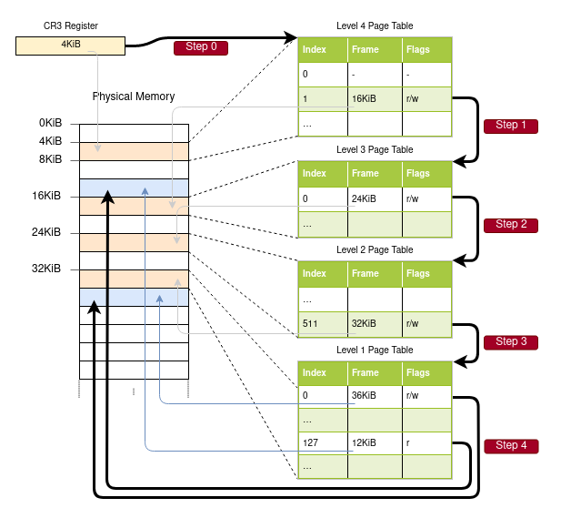
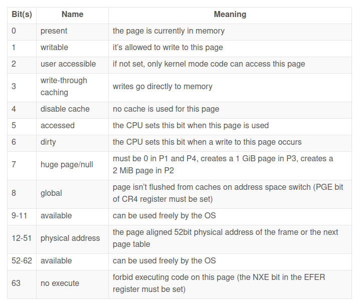

## Paging on x86_64
The x86_64 architecture uses a 4-level page table and a page size of 4 KiB. Each page table, independent of the level, has a fixed size of 512 entries. Each entry has a size of 8 bytes, so each table is 512 * 8 B = 4 KiB large and thus fits exactly into one page.

The mapping from virtual to physical address is done by the memory management unit (MMU) which is a hardware device and this mapping is known as paging technique.

With these indices, we can now walk the page table hierarchy to determine the mapped frame for the address:

  1. We start by reading the address of the level 4 table out of the CR3 register.
  2. The level 4 index is 1, so we look at the entry with index 1 of that table, which tells us that the level 3 table is stored at address 16 KiB.
  3. We load the level 3 table from that address and look at the entry with index 0, which points us to the level 2 table at 24 KiB.
  4. The level 2 index is 511, so we look at the last entry of that page to find out the address of the level 1 table.
  5. Through the entry with index 127 of the level 1 table, we finally find out that the page is mapped to frame 12 KiB, or 0x3000 in hexadecimal.
  6. The final step is to add the page offset to the frame address to get the physical address 0x3000 + 0x5ce = 0x35ce.

The permissions for the page in the level 1 table are r, which means read-only. The hardware enforces these permissions and would throw an exception if we tried to write to that page. Permissions in higher level pages restrict the possible permissions in lower levels, so if we set the level 3 entry to read-only, no pages that use this entry can be writable, even if lower levels specify read/write permissions.

## Page Table Format
Page tables on the x86_64 architecture are basically an array of 512 entries.

Each entry is 8 bytes (64 bits) large and has the following format:

Only bits 12–51 are used to store the physical frame address. The remaining bits are used as flags or can be freely used by the operating system. This is possible because we always point to a 4096-byte aligned address, either to a page-aligned page table or to the start of a mapped frame. This means that bits 0–11 are always zero, so there is no reason to store these bits because the hardware can just set them to zero before using the address. The same is true for bits 52–63, because the x86_64 architecture only supports 52-bit physical addresses

Available flags:

  - The `present flag` differentiates mapped pages from unmapped ones. It can be used to temporarily swap out pages to disk when the main memory becomes full. When the page is accessed subsequently, a special exception called page fault occurs, to which the operating system can react by reloading the missing page from disk and then continuing the program.
  - The `writable and no execute flags` control whether the contents of the page are writable or contain executable instructions, respectively.
  - The `accessed and dirty flags` are automatically set by the CPU when a read or write to the page occurs. This information can be leveraged by the operating system, e.g., to decide which pages to swap out or whether the page contents have been modified since the last save to disk.
  - The `write-through caching and disable cache flags` allow the control of caches for every page individually.
  - The `user accessible flag` makes a page available to userspace code, otherwise, it is only accessible when the CPU is in kernel mode. This feature can be used to make system calls faster by keeping the kernel mapped while a userspace program is running. However, the Spectre vulnerability can allow userspace programs to read these pages nonetheless.
  - The `global flag` signals to the hardware that a page is available in all address spaces and thus does not need to be removed from the translation cache (see the section about the TLB below) on address space switches. This flag is commonly used together with a cleared user accessible flag to map the kernel code to all address spaces.
  - The `huge page` flag allows the creation of pages of larger sizes by letting the entries of the level 2 or level 3 page tables directly point to a mapped frame. With this bit set, the page size increases by factor 512 to either 2 MiB = 512 * 4 KiB for level 2 entries or even 1 GiB = 512 * 2 MiB for level 3 entries. The advantage of using large.

## The Translation Lookaside Buffer
A 4-level page table makes the translation of virtual addresses expensive because each translation requires four memory accesses. To improve performance, the x86_64 architecture caches the last few translations in the so-called translation lookaside buffer (TLB). This allows skipping the translation when it is still cached

Unlike the other CPU caches, the TLB is not fully transparent and does not update or remove translations when the contents of page tables change. This means that the kernel must manually update the TLB whenever it modifies a page table. To do this, there is a special CPU instruction called invlpg (“invalidate page”) that removes the translation for the specified page from the TLB, so that it is loaded again from the page table on the next access. The TLB can also be flushed completely by reloading the CR3 register, which simulates an address space switch.

The CR2 register is automatically set by the CPU on a page fault and contains the accessed virtual address that caused the page fault.
