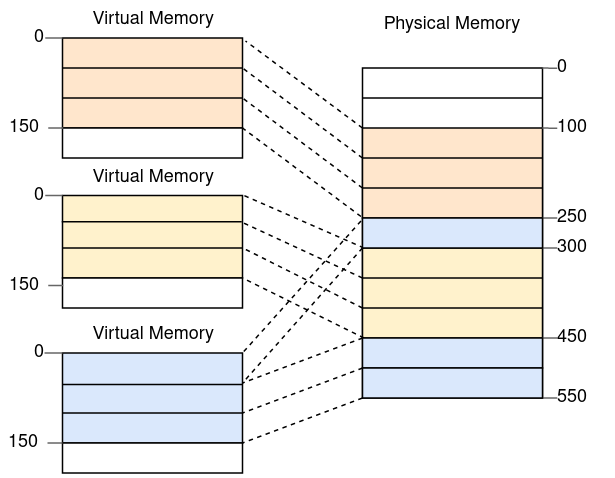
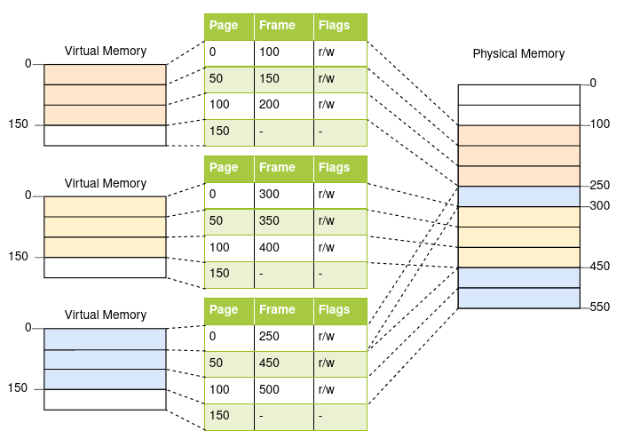
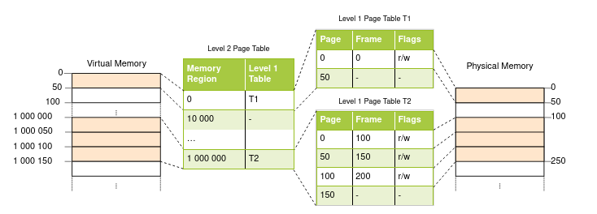

# Paging
The idea is to divide both the virtual and physical memory space into small, fixed-size blocks. The blocks of the virtual memory space are called pages, and the blocks of the physical address space are called frames. Each page can be individually mapped to a frame, which makes it possible to split larger memory regions across non-continuous physical frames.

In this example, we have a page size of 50 bytes, which means that each of our memory regions is split across three pages. Each page is mapped to a frame individually, so a continuous virtual memory region can be mapped to non-continuous physical frames. This allows us to start the third instance of the program without performing any defragmentation before.

Internal fragmentation occurs because not every memory region is an exact multiple of the page size. Imagine a program of size 101 in the above example: It would still need three pages of size 50, so it would occupy 49 bytes more than needed. To differentiate the two types of fragmentation, the kind of fragmentation that happens when using segmentation is called external fragmentation. Internal fragmentation still wastes memory, but does not require defragmentation and makes the amount of fragmentation predictable

## Page table

Each program instance has its own page table. A pointer to the currently active table is stored in a special CPU register. On x86, this register is called CR3. It is the job of the operating system to load this register with the pointer to the correct page table before running each program instance.

On each memory access, the CPU reads the table pointer from the register and looks up the mapped frame for the accessed page in the table. This is entirely done in hardware and completely invisible to the running program. To speed up the translation process, many CPU architectures have a special cache that remembers the results of the last translations.

## Multilevel Page Tables
If a program that uses the four virtual pages 0, 1_000_000, 1_000_050, and 1_000_100. It only needs 4 physical frames, but the page table has over a million entries. We can’t omit the empty entries because then the CPU would no longer be able to jump directly to the correct entry in the translation process (e.g., it is no longer guaranteed that the fourth page uses the fourth entry).

To reduce the wasted memory, we can use a two-level page table. The idea is that we use different page tables for different address regions. An additional table called level 2 page table contains the mapping between address regions and (level 1) page tables.

Links
- https://www.geeksforgeeks.org/paging-in-operating-system/
- https://www.guru99.com/paging-in-operating-system.html
- https://eng.libretexts.org/Courses/Delta_College/Operating_System%3A_The_Basics/08%3A_Virtual_Memory/8.1%3A_Memory_Paging
- https://developer.arm.com/documentation/101811/0102/The-Memory-Management-Unit--MMU-
- https://wiki.osdev.org/Paging
- https://stackoverflow.com/questions/67033820/what-is-paging-exactly-osdev
